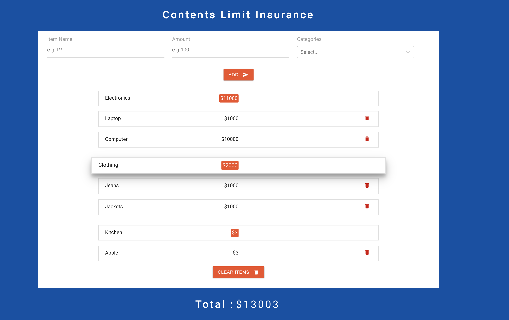

# CLInsurance
> a simple web-application that would allow a customer to calculate the total contents limit they require and maintain a list of high-value items.

## Technologies:
 - 1 web site in react
 - 1 api fullrest write in dotnet core
 - 1 api-test unit-test project of the rest api
 - 1 SQL Server dockerized in docker
# Getting Started
It contains 4 projects. Here are a set of list of intructions of how to get each project to works.
## Web
React project create with create-react-app. You must build the application by running in the its own dir:

    yarn build & yarn start
## API
Api in dotnet core that allows to connect to the database. You must build the database first before build and publish this application in VS

    dotnet publish -o ./publish
## Sql
Database for data storage. A script creates the database when docker starts.

## Docker-compose
You can use the following command line for build docker image:

    docker-compose -f docker-compose-build.yml up --build -d
    docker exec -it sql "bash"
    ./docker-import.sh

